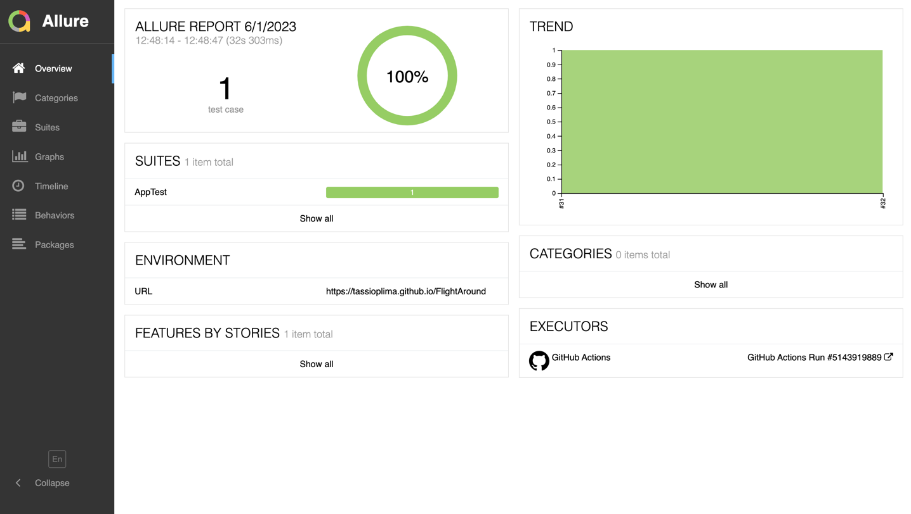

# Automation

Automation project with Java + Gradle using Browser Stack as a Device Farm and Github Action (CI) to automate the Automation App, GithubPages to deploy Allure Serve to see test result/report, PageObject/Screen and PageFactory as a structure.

[](https://github.com/tassioplima/miniSDK/actions)
[](https://tassioplima.github.io/miniSDK/)

Configuration:

- Java JDK 1.8
- Android SDK updated
- Android Emulator or physical device
- Appium Server installed 
- Browser Stack Account and Keys

Running:

```
./gradlew test --tests "AppTest"
```

You can run with different devices like iOS and Android using properties when running this command line:

Android:

```
./gradlew test --tests "AppTest" -DMOBILE=android
```

iOS:

```
./gradlew test --tests "AppTest" -DMOBILE=ios
```
We have two possibilities for execution the local one and the remote, using the property boolean false or true you can setup on cli command


true = execution using  remote.json and runs on Browser Stack using some secrets keys on github repository

```
./gradlew test --tests "AppTest" -DMOBILE=android -DEXEC=true
```

false = execution using local.json  properties locally

```
./gradlew test --tests "AppTest" -DMOBILE=android -DEXEC=false
```

### Building Allure report

To build a report, and browse it use the following command:

```
./gradlew allureServe
```

Github Pages with Allure report results: [ALLURE](https://tassioplima.github.io/miniSDK/)


